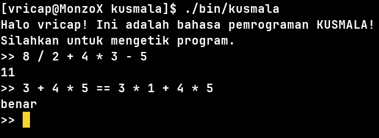

# kusmala  
**masih dalam pengembangan*  

id:  
Sebuah bahasa pemrograman interpretasi dengan penegasan pada Bahasa Indonesia. Ditulis dalam Go.  


en:  
A interpreted programming language with emphasis on Indonesian language. Written in Go.  

## Pemasangan  
### Build from source  
Clone repo ini:
```
$ git clone https://github.com/Vricap/kusmala.git  
$ cd kusmala
```  

Build dengan *make*:  
```
$ make
```  
Pastikan dalam komputer mu sudah terpasang [make](https://www.gnu.org/software/make/) dan [Go](https://go.dev/). Binary akan berada di `./bin/kusmala`  

Alternatif tanpa *make*:  
```
$ go build -o ./bin/ .
```  
Lakukan ini jika tidak mempunyai *make*.  

## Penggunaan  
Menjalankan kusmala tanpa argumen akan membuka REPL:  
  

### Contoh Kode  
```
buat faktorial = fungsi(x) {	// fungsi literal
	jika(x == 1) {		// kondisional
		kembalikan 1;
	}
	kembalikan x * faktorial(x - 1); // rekursif
}

buat nilai = 5;
buat hasil = faktorial(nilai);	// pemanggilan fungsi
cetak("Hasil dari faktorial", nilai, "adalah", hasil); // cetak akan mengeluarkan hasil ke stdout
```  

Menjalankan kode dari file:  
```
$ ./bin/kusmala ./example/faktorial.km  
Hasil dari faktorial 5 adalah 120
```  
Tempatkan lokasi file pada argumen ke dua.  

Gunakan argumen `-tree` untuk mencetak pohon AST dari kode:  
```
$ ./bin/kusmala ./example/faktorial.km -tree  
AST_TREE:
  BUAT_STATEMENT:
    IDENT: faktorial
    FUNGSI_EXPRESSION: 
      PARAMS: 
        IDENT: x
      FUNGSI_BODY: 
        JIKA_STATEMENT:
          CONDITION:
            INFIX_EXPRESSION:
              IDENT: x
              OEPERATOR: ==
              INTEGER_LITERAL: 1
            JIKA_BLOCK: 
              KEMBALIKAN_STATEMENT:
                INTEGER_LITERAL: 1

        KEMBALIKAN_STATEMENT:
          INFIX_EXPRESSION:
            IDENT: x
            OEPERATOR: *
            CALL_EXPRESSION: 
              IDENT: faktorial
              ARGUMENTS: 
                INFIX_EXPRESSION:
                  IDENT: x
                  OEPERATOR: -
                  INTEGER_LITERAL: 1

  BUAT_STATEMENT:
    IDENT: nilai
    INTEGER_LITERAL: 5

  BUAT_STATEMENT:
    IDENT: hasil
    CALL_EXPRESSION: 
      IDENT: faktorial
      ARGUMENTS: 
        IDENT: nilai

  CETAK_STATEMENT: 
    EXPRESSION: 
      STRING_LITERAL: Hasil dari faktorial
      IDENT: nilai
      STRING_LITERAL: adalah
      IDENT: hasil
```  
